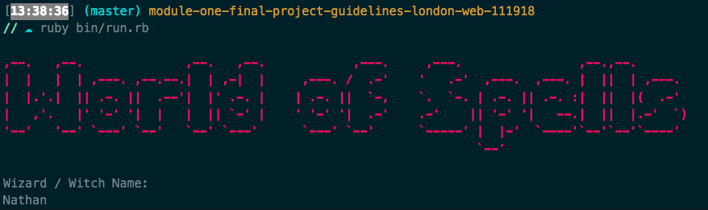
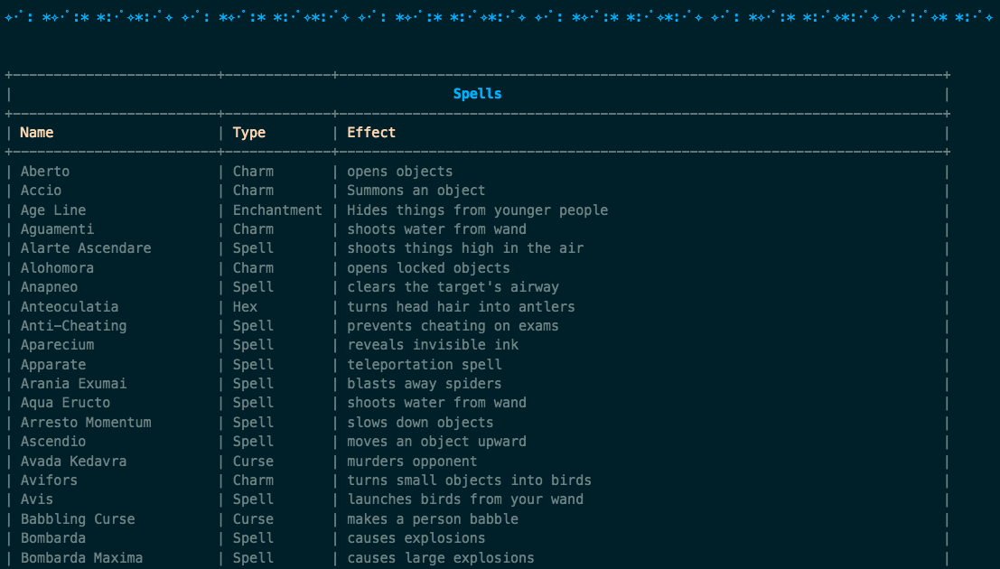
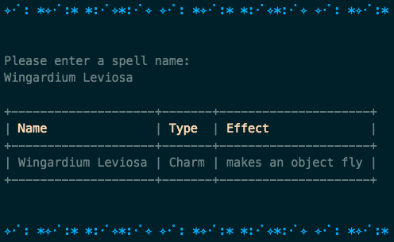
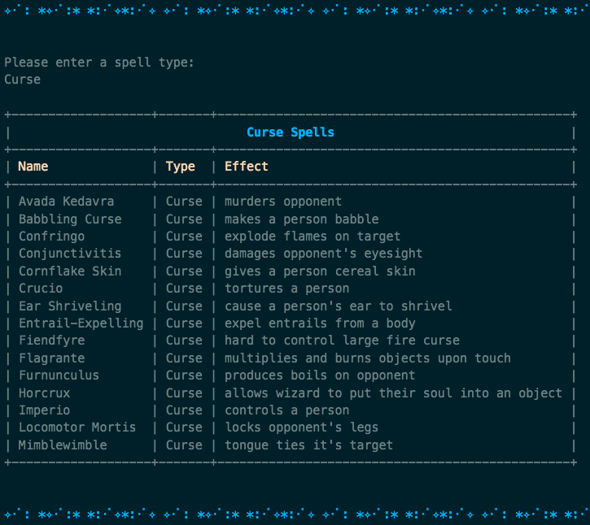
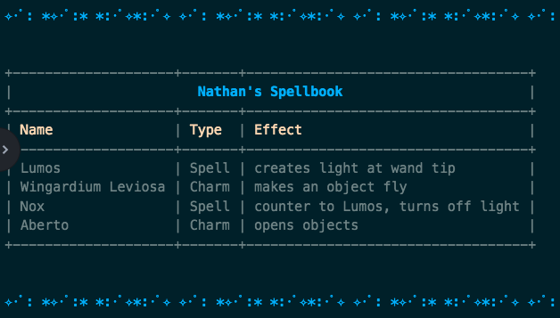
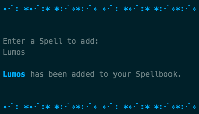
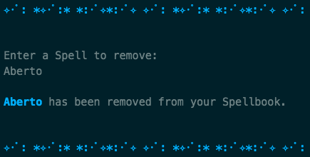
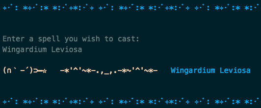

# 🔮 World of Spells 🔮

## Flatiron Module 1 Final Project
World of Spells is a small CLI app for all the Harry Potter lovers out there.

Spells API - https://www.potterapi.com/

### MVP

1. Enter your name and get sorted into a House ✔️
2. See all the spells ✔️
3. See your Spellbook ✔️
4. Save spells to your Spellbook ✔️
5. Delete spells from your Spellbook ✔️

### Stretch Goals

1. Cast a spell from your Spellbook ✔️
2. Change UI color based on house ✔️
3. Play Hedwigs theme music ✔️

### Installation

1. Run `brew install sdl2`. This is a prereq for the gosu gem
2. Run `bundle`
3. Run `rake db:migrate` and `rake db:seed`
4. `ruby bin/run.rb` to start the app

### Demo

Welcome screen

Menu

List all spells

Find spell

Find spell type

View spellbook

Add spell to spellbook

Remove spell from spellbook

Cast a spell from spellbook

Quit

