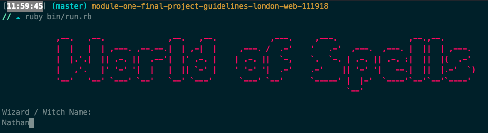
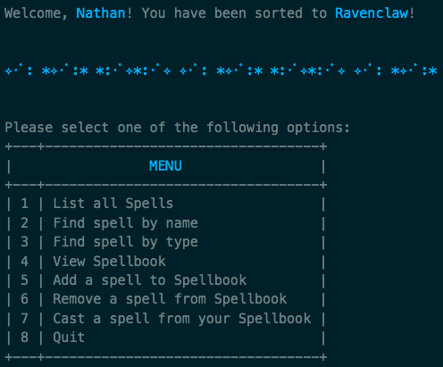

# 🔮 World of Spells 🔮

## Flatiron Module 1 Final Project
World of Spells is a small CLI app for all the Harry Potter lovers out there.

The spells API was used from https://www.potterapi.com/

### MVP

1. Enter your name and get sorted into a House ✔️
2. See all the spells ✔️
3. See your Spellbook ✔️
4. Save spells to your Spellbook ✔️
5. Delete spells from your Spellbook ✔️

### Stretch Goals

1. Cast a spell from your Spellbook ✔️
2. Change UI color based on house ✔️
3. Play Hedwigs theme music ✔️

### Demo

Welcome screen

Menu

